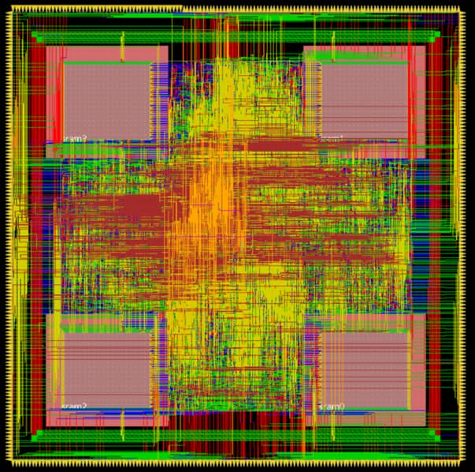

# QR Decomposition
## Final Project from Computer-aided VLSI System Design
- We design a robust QR decomposition chip from frontend to backend
- Please check out the 1121_Final_introduction.pdf to get full information and ranking details
- Our implementation details are recorded in reports/team11_report.pdf

## Final Performance
- **Our performance evaluation reaches IC-design engineer level in TA's ranking**
- Maximum operating frequency: 215(MHz)
- Performance Gain: 1.76
- POST-SIM cycle: 4.65 (ns)
- POST-SIM latency: 1215205 (ns)
- Post layout area: 336312.65 (um^2)
- Post layout total power: 24.3 (mW)
- Status of LVS check: pass

